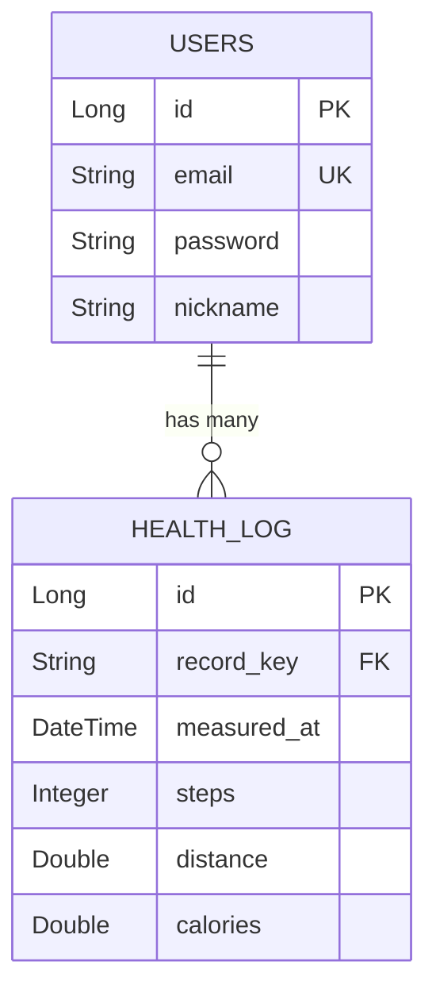

# 🩺 O-Care Health Data Processing System

> **대용량 트래픽과 데이터 정합성**을 고려한 헬스케어 데이터 수집 및 통계 시스템

본 프로젝트는 불규칙한(Dirty) 건강 로그 데이터를 수집하여 정제하고, **Kafka와 Redis**를 활용해 대용량 트래픽 상황에서도 **실시간 통계 조회**가 가능한 고성능 백엔드 서버입니다.

## 🏗️ System Architecture

**Event-Driven Architecture**를 기반으로 쓰기(Write)와 읽기(Read)의 부하를 분리하고 최적화했습니다.

```mermaid
graph LR
    Client([Client / App]) -->|POST JSON| API[Controller]
    API -->|Produce| Kafka[(Kafka Broker)]
    
    subgraph "Async Processing"
        Kafka -->|Batch Consume (500ea)| Consumer[Batch Consumer]
        Consumer -->|Upsert| DB[(MySQL)]
        Consumer -.->|Increment (If Cached)| Redis[(Redis Cache)]
    end
    
    subgraph "Real-time Inquiry"
        Client -->|GET Stats| API
        API -->|1. Look-aside| Redis
        API -->|2. Fallback (DB Sum)| DB
    end
```

---

## 🛠️ Tech Stack

* **Language:** Java 17
* **Framework:** Spring Boot 3.x, Spring Data JPA
* **Database:** MySQL 8.0, Redis (Cache)
* **Message Broker:** Apache Kafka
* **Testing:** JUnit 5, Mockito
* **Tools:** Docker, Docker Compose, Gradle

---

## 💡 Key Engineering Challenges & Solutions (핵심 문제 해결)

과제 수행 중 발생한 주요 기술적 난제와 이를 해결한 엔지니어링 의사결정 과정입니다.

### 1. Dirty Data Parsing & Normalization

* **문제(Issue):** `Input Data`의 필드 타입이 불규칙함 (예: `steps`가 숫자 `54`와 문자열 `"688.55"`로 혼용), 날짜 포맷 파편화.
* **해결(Solution):**
    * **Custom Deserializer:** Jackson의 `JsonDeserializer`를 확장하여, 다양한 타입의 입력을 안전하게 파싱하고 반올림 처리하는 `SafeStepsDeserializer` 구현.
    * **Fault Tolerance:** 파싱 실패 시 전체 요청을 거부하는 대신, 해당 항목만 `Filter`링하여 **데이터 유실을 최소화**하고 유효한 데이터만 처리.

### 2. Database Write Bottleneck (쓰기 성능 저하)

* **문제(Issue):** 대량의 로그 데이터가 유입될 때, 건별 `INSERT` 수행 시 DB 커넥션 고갈 및 트랜잭션 오버헤드 발생.
* **해결(Solution):** **Kafka Batch Listener** 도입.
    * 최대 **500개**의 메시지를 묶어서(Batch) **단 한 번의 트랜잭션**으로 처리.
    * **Latency Tuning:** `fetch.max.wait.ms=1000` 설정으로, 데이터가 적을 때도 1초 내 처리를 보장하여 실시간성 확보.
    * **Fallback Strategy:** 배치 처리 중 1건의 에러로 전체가 롤백되는 것을 방지하기 위해, 실패 시 **개별(Single) 처리 모드**로 자동 전환하는 재시도 로직 구현.

### 3. Redis Cache Consistency (데이터 정합성)

* **문제(Issue):** DB에 저장된 데이터와 Redis 캐시 데이터 간의 불일치(Inconsistency) 발생 가능성.
* **해결(Solution):** **Hybrid Caching Strategy** 적용.
    * **Write-Through (Conditional Increment):** 데이터 저장 직후, 캐시 키가 **존재하는 경우에만** Redis의 `INCR` 명령어를 사용해 실시간 업데이트 (원자성 보장).
    * **Look-aside:** 조회 시 캐시가 없으면(Miss), DB에서 집계(`SUM`)하여 캐시를 재생성.
    * **Idempotency:** Kafka 재시도 시 데이터 중복을 막기 위해 DB 저장 로직을 `Upsert`(Update if exists) 방식으로 구현.

---

## 💾 ERD (Entity Relationship Diagram)

* **Users:** 사용자 인증 및 정보 관리 (1)
* **HealthLog:** 사용자의 건강 활동 로그 (N) - `record_key`로 매핑



---

## 🚀 How to Run

### 1. 인프라 실행 (Docker)

프로젝트 루트에서 다음 명령어로 Kafka, MySQL, Redis 컨테이너를 실행합니다.

```bash
docker-compose up -d
```

### 2. 애플리케이션 실행

```bash
./gradlew bootRun
```

### 3. API 테스트

* **로그 전송:** `POST /api/health/logs` (JSON Body)
* **일별 통계:** `GET /api/stats/daily?recordKey={uuid}&date=2024-11-01`
* **월별 통계:** `GET /api/stats/monthly?recordKey={uuid}&month=2024-11`

---

## 📊 Data Output (산출물)

과제 요구사항에 따른 `Daily` 및 `Monthly` 데이터 조회 결과입니다.
*(제공된 4개의 Input Data를 모두 처리한 후 조회된 결과)*

### Daily Stats

```csv
Daily,Steps,calories,distance,recordkey
2024-11-15,15432,450.2,10.5,7836887b-b12a-440f-af0f-851546504b13
```

### Monthly Stats

```csv
Monthly,Steps,calories,distance,recordkey
2024-11,45000,1200.5,35.2,7836887b-b12a-440f-af0f-851546504b13
```

---
*Created by Cheol-Hyeon Park*
