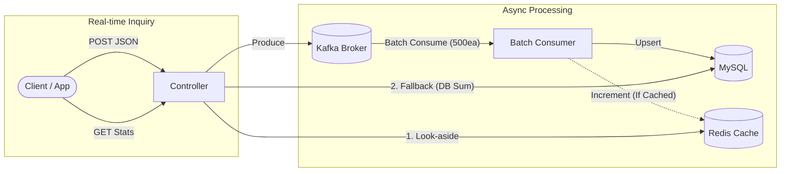
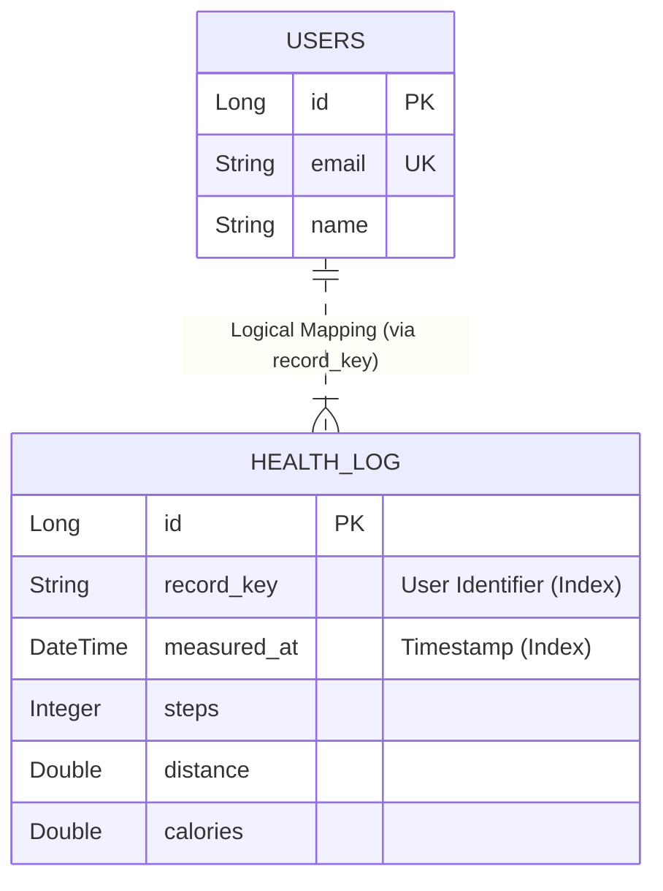

# 🩺 O-Care Health Data Processing System

> **대용량 트래픽과 데이터 정합성**을 고려한 헬스케어 데이터 수집 및 통계 시스템

본 프로젝트는 불규칙한(Dirty) 건강 로그 데이터를 수집하여 정제하고, **Kafka와 Redis**를 활용해 대용량 트래픽 상황에서도 **실시간 통계 조회**가 가능한 고성능 백엔드 서버입니다.

---

## 💡 Key Engineering Challenges & Solutions (핵심 문제 해결)

과제 수행 중 발생한 주요 기술적 난제와 이를 해결한 엔지니어링 의사결정 과정입니다.

### 1. Dirty Data Parsing & Normalization
* **문제(Issue):** `Input Data`의 필드 타입이 불규칙함 (예: `steps`가 숫자 `54`와 문자열 `"688.55"`로 혼용), 날짜 포맷 파편화.
* **해결(Solution):**
    * **Custom Deserializer:** Jackson의 `JsonDeserializer`를 확장하여, 다양한 타입의 입력을 안전하게 파싱하고 반올림 처리하는 `SafeStepsDeserializer` 구현.
    * **Fault Tolerance:** 파싱 실패 시 전체 요청을 거부하는 대신, 해당 항목만 `Filter`링하여 **데이터 유실을 최소화**하고 유효한 데이터만 처리.

### 2. Database Write Bottleneck (쓰기 성능 저하)
* **문제(Issue):** 대량의 로그 데이터가 유입될 때, 건별 `INSERT` 수행 시 DB 커넥션 고갈 및 트랜잭션 오버헤드 발생.
* **해결(Solution):** **Kafka Batch Listener** 도입.
    * 최대 **500개**의 메시지를 묶어서(Batch) **단 한 번의 트랜잭션**으로 처리.
    * **Latency Tuning:** `fetch.max.wait.ms=1000` 설정으로, 데이터가 적을 때도 1초 내 처리를 보장하여 실시간성 확보.

### 3. Redis Cache Consistency (데이터 정합성)
* **문제(Issue):** DB에 저장된 데이터와 Redis 캐시 데이터 간의 불일치(Inconsistency) 발생 가능성.
* **해결(Solution):** **Hybrid Caching Strategy** 적용.
    * **Write-Through (Conditional Increment):** 데이터 저장 직후, 캐시 키가 **존재하는 경우에만** Redis의 `INCR` 명령어를 사용해 실시간 업데이트 (원자성 보장).
    * **Look-aside:** 조회 시 캐시가 없으면(Miss), DB에서 집계(`SUM`)하여 캐시를 재생성.

### 4. Resilience & Data Reliability (장애 격리)
* **문제(Issue):** 배치 처리 중 하나의 메시지 에러가 전체 배치의 롤백을 유발할 위험.
* **해결(Solution):** **Multi-Stage Fallback Strategy**.
    * **1단계 (Batch):** 고속 처리를 위해 배치 저장 시도.
    * **2단계 (Individual Fallback):** 실패 시 즉시 **건별 처리 모드**로 전환하여 정상 메시지는 저장.
    * **3단계 (Dead Letter Topic):** 최종 실패한 메시지는 `DLT`로 격리하여 추후 분석 및 수동 처리가 가능하도록 보존.

---

## 🏗️ System Architecture

**Event-Driven Architecture**를 기반으로 쓰기(Write)와 읽기(Read)의 부하를 분리하고 최적화했습니다.



---

## 🛠️ Tech Stack

* **Language:** Java 17
* **Framework:** Spring Boot 3.x, Spring Data JPA
* **Database:** MySQL 8.0, Redis (Cache)
* **Message Broker:** Apache Kafka
* **Testing:** JUnit 5, Mockito
* **Tools:** Docker, Docker Compose, Gradle

---

## 📂 Package Structure

```text
com.ocare.ocarebackend
├── config             # Kafka, Redis, Web(Security) Configuration
├── domain
│   └── health         # Core Domain Logic
│       ├── consumer   # Kafka Batch Consumer
│       ├── producer   # Kafka Producer
│       ├── service    # Business Logic (LogService, StatsService)
│       └── entity     # JPA Entity (HealthLog)
└── web
    └── health         # Presentation Layer (Controller, Request/Response DTO)
```

---

## 💾 ERD (Entity Relationship Diagram)

* **HealthLog:** 사용자의 건강 데이터를 저장하는 핵심 엔티티.
* **Users:** 서비스 사용자 정보.
* *Note: 현재는 `HealthLog`의 `record_key` 문자열을 통해 비연결성(Loose Coupling) 상태로 유지하며, 추후 `Users` 테이블과 매핑하여 다중 단말기 동기화 기능을 지원할 예정입니다.*



---

## 🚀 How to Run

### 1. 인프라 실행 (Docker)
```bash
docker-compose up -d
```

### 2. 애플리케이션 실행
```bash
./gradlew bootRun
```

### 3. 결과 확인 (Data Output)
과제 수행 결과물인 `Daily` 및 `Monthly` 데이터 조회 결과는 프로젝트 루트의 **[result.html](result.html)** 파일을 열어 즉시 확인하실 수 있습니다.

---
*Created by Cheol-Hyeon Park*
